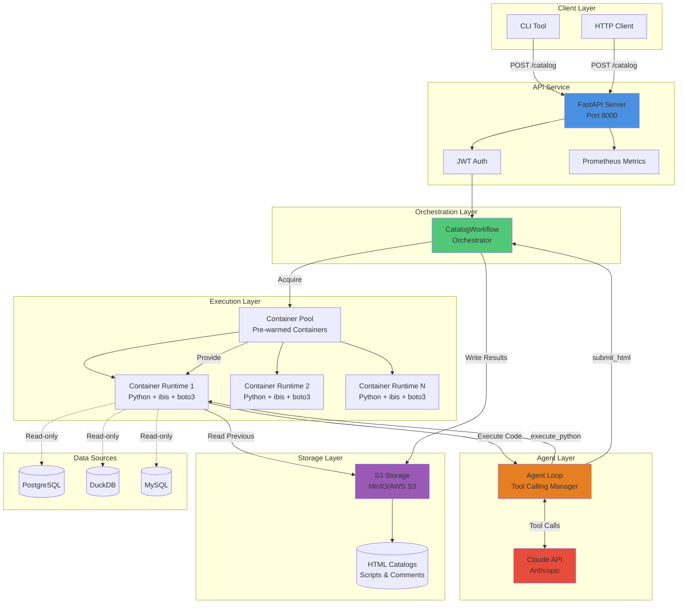
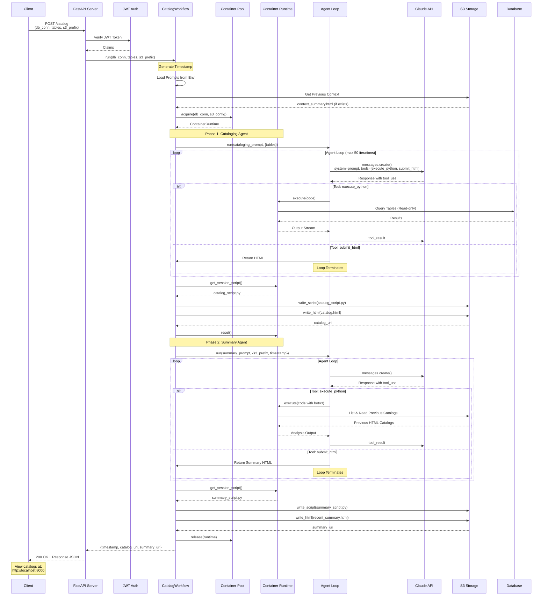

# Cataloger

An LLM-powered database cataloging service that generates qualitative snapshots
of your data over time.

## Overview

Cataloger takes a readonly database connection and produces HTML reports that
capture the "qualitative nature" of your data. Instead of just collecting
metrics, it uses LLM agents to explore your database, run analyses, and generate
human-readable reports that serve as temporal records of your data's state.

### Key Concepts

- **HTML as State**: Catalog outputs are HTML files stored in object storage.
  There is no separate metadata database - the HTML artifacts ARE the
  application state.
- **Agent-Driven Exploration**: Rather than hardcoding specific queries, agents
  receive prompts instructing them what to investigate and have the freedom to
  explore via code execution.
- **Temporal Analysis**: Individual snapshots don't need to be perfect.
  Downstream agents analyze sequences of catalogs to identify trends, anomalies,
  and changes over time.
- **Code Over Tools**: Agents use a single `execute_python()` tool, following
  the patterns from Armin Ronacher's articles on
  ["Tools"](https://lucumr.pocoo.org/2025/7/3/tools/) and
  ["Code MCPs"](https://lucumr.pocoo.org/2025/8/18/code-mcps/). This
  enables compositional, reviewable analysis with persistent state.

## Quick Start

```bash
# 1. Setup (one command!)
uv run cataloger admin setup-env
# Edit .env.server and add your LLM_API_KEY and S3 credentials

# 2. Start services
./scripts/start-dev-services.sh  # MinIO (local S3)
./scripts/build-container.sh     # Agent container
./scripts/bootstrap-db.sh         # Sample databases
./scripts/run-server.sh          # Cataloger server

# 3. Generate a catalog
export CATALOGER_AUTH_TOKEN=$(uv run cataloger generate-token your-secret)
uv run cataloger catalog \
  --db-conn "duckdb:////data/sample_ecommerce.duckdb" \
  --table users --table orders \
  --s3-prefix "test/ecommerce"

# 4. View at: http://localhost:8000
```

**See [GETTING_STARTED.md](./GETTING_STARTED.md) for detailed setup.**

## Architecture

### System Architecture

The following diagram shows the high-level system architecture and how components interact:



### Workflow Execution Flow

This diagram shows the detailed business logic flow when a catalog request is processed:



### Components

**API Service**: Receives POST requests to trigger catalog generation

**DBOS Workflows**: Orchestrates agent execution pipeline as Python functions

**Container Pool**: Pre-warmed Docker containers with Python + ibis + database
drivers

**Agent Runtime**:

- Each agent gets two tools: `execute_python(code)` and `submit_html(content)`
- `execute_python()` returns a single output stream from code execution (like an
  IPython session - expressions, prints, errors all interleaved naturally)
- `submit_html()` is the terminal tool that ends the agent loop
- Container persists across workflow, but each agent gets a fresh Python process

**Object Storage**: S3-compatible storage organized as:

```
s3://bucket/prefix/
  2024-01-15T10:00:00Z/
    catalog.html
    recent_summary.html
    other_agent.html
  2024-01-15T11:00:00Z/
    ...
```

## How It Works

### Cataloging Agent

1. Receives readonly database connection string (via container env) and list of
   tables
2. Uses `execute_python()` to import ibis and query the database
3. Generates summary statistics (top 10 values, null counts, distributions,
   etc.)
4. Formats results as HTML tables (keeping tables ≤20 rows for efficiency)
5. Calls `submit_html()` with final report

The agent's behavior is entirely prompt-driven. You can instruct it to:

- Run specific queries on each table
- Include or exclude SQL in output
- Focus on particular columns or patterns
- Adjust summary granularity

### Summary Agent

1. Receives S3 prefix and timestamp
2. Uses `execute_python()` with boto3 to list and fetch previous catalogs
3. Analyzes temporal trends across recent snapshots
4. Generates summary HTML identifying changes, anomalies, or "good/bad" states
5. Calls `submit_html()` with analysis report

What constitutes "good" or "bad" is specified in the agent's prompt, making it
adaptable to different use cases.

## Safety & Constraints

- **Readonly Connections**: Agents can query but never mutate data
- **Token Budget**: Prevents runaway agent exploration (generous but bounded)
- **Container Timeout**: Backstop for hung processes (rarely triggered in
  practice)
- **Result Limits**: Summary tables capped at ~20 rows to keep outputs
  digestible

## Configuration

Prompts are stored as YAML in the repository, base64-encoded, and passed to
server/worker processes via environment variables. This makes prompt evolution
explicit and version-controlled.

## Use Cases

- **Data Quality Monitoring**: Track distributions, null rates, and anomalies
  over time
- **Schema Evolution**: Detect when tables grow, shrink, or change shape
- **Compliance Auditing**: Maintain qualitative records of data state for audit
  trails
- **Team Visibility**: Human-readable HTML reports accessible to non-technical
  stakeholders

## Why This Approach?

Traditional data profiling tools generate fixed metrics. Cataloger's
agent-driven approach allows flexible, context-aware analysis that evolves with
your needs. By storing HTML snapshots and using downstream agents for temporal
analysis, you get both human-readable reports and machine-analyzable trends
without rigid schemas or upfront metric definitions.

The "secret sauce" is trusting agents to be "good enough" at individual
snapshots, then using more sophisticated agents to extract signal from the
temporal sequence.
